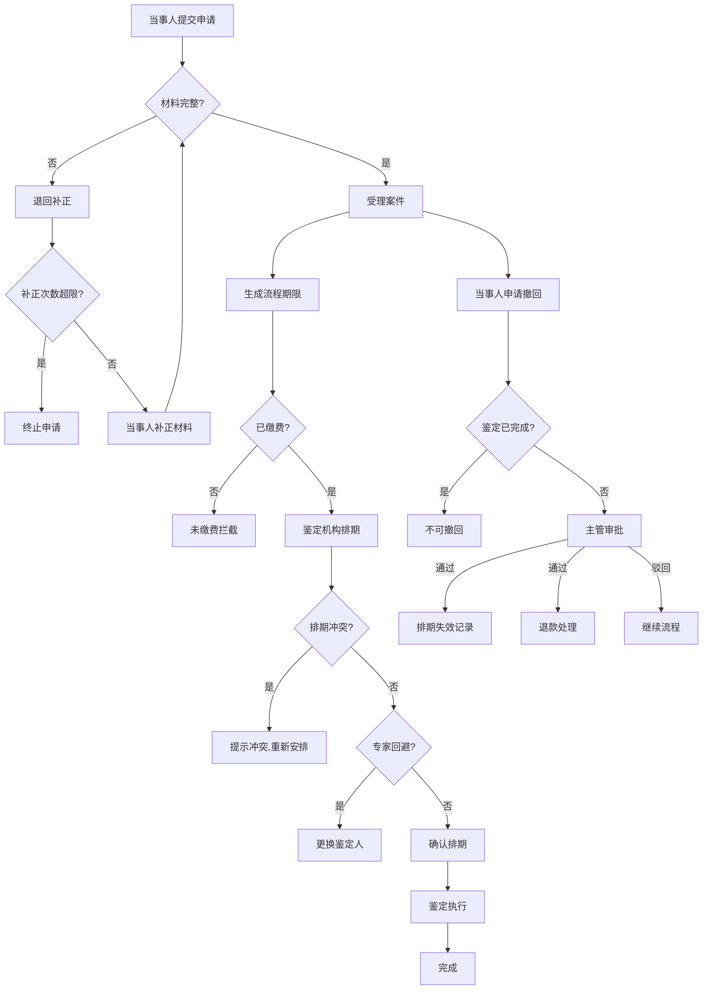

## 1. 产品概述

司法鉴定预约与协作管理系统，面向当事人、窗口人员、鉴定机构和主管人员，实现鉴定预约、材料审核与补正、排期资源管理、撤回失效、费用缴纳、期限预警等全流程闭环。解决传统司法鉴定中材料流转不透明、排期冲突、期限失控、撤回混乱等痛点。

- 目标用户：法院/司法局窗口工作人员、案件当事人、鉴定机构排期人员、司法主管部门管理人员
- 市场价值：提升司法鉴定流转效率，减少材料缺失和排期冲突，实现全流程可审计可追溯

## 2. 核心功能

### 2.1 用户角色

| 角色 | 注册方式 | 核心权限 |
|------|---------|---------|
| 当事人 | 自助注册 | 提交预约申请、查看进度、缴费、申请撤回 |
| 窗口人员 | 管理员分配 | 审核材料、退回补正、受理案件 |
| 鉴定机构 | 管理员分配 | 排期管理、资源分配、鉴定人回避、改期 |
| 主管人员 | 管理员分配 | 撤回审批、加急审批、重复案件处理、监管审计 |

### 2.2 功能模块

1. **申请端**：案件信息录入、鉴定类型选择、材料清单提交、联系方式填写、进度查询、费用缴纳、撤回申请
2. **审核端**：材料完整性审核、退回补正、受理确认、材料版本追踪、补正次数校验
3. **排期端**：排期资源管理、时间地点安排、鉴定人分配、资源冲突检测、专家回避、改期处理
4. **主管端**：撤回审批、加急审批、重复案件检测与合并、流程监管
5. **费用端**：费用缴纳、发票生成、退款处理、缴费拦截
6. **期限端**：流程期限生成、节假日顺延、期限预警、补正/退回/撤回/加急/改期影响期限
7. **日志端**：不可变审计日志、材料密封流转、电子签收、签收记录

### 2.3 页面详情

| 页面名称 | 模块名称 | 功能描述 |
|---------|---------|---------|
| 申请提交页 | 案件信息 | 录入案件编号、当事人信息、鉴定类型、材料清单、联系方式 |
| 我的申请页 | 进度查询 | 查看申请状态、补正通知、排期结果、费用信息、期限倒计时 |
| 材料审核页 | 审核工作台 | 材料完整性审核、退回补正（含补正意见）、受理确认、材料版本对比 |
| 排期管理页 | 排期工作台 | 日历视图排期、资源冲突检测、鉴定人分配、专家回避标记、机构容量检查 |
| 撤回审批页 | 主管审批 | 撤回申请审批、加急审批、审批原因记录、已有排期自动失效 |
| 费用管理页 | 费用处理 | 费用缴纳、发票下载、退款申请、未缴费拦截提示 |
| 期限预警页 | 期限监控 | 流程期限展示、节假日顺延计算、即将到期预警、超期标红 |
| 流程日志页 | 审计追踪 | 全流程操作日志、材料密封流转记录、电子签收、不可变审计 |
| 重复案件页 | 案件查重 | 同一案件重复预约检测、合并/驳回处理 |

## 3. 核心流程

### 3.1 主流程

当事人提交申请 → 窗口审核材料 → 退回补正或受理 → 受理后生成流程期限 → 缴纳费用 → 鉴定机构排期 → 排期冲突检测 → 鉴定执行 → 完成

### 3.2 关键业务规则

- **材料缺失拦截**：材料不完整不允许排期
- **重复案件拦截**：同一案件编号不能重复预约
- **补正重审**：补正后必须重新审核，补正次数有限制
- **排期冲突检测**：时间/地点/鉴定人冲突不能保存
- **撤回失效**：撤回后已有排期自动失效（形成失效记录，不删除历史）
- **已完成不可撤回**：鉴定已完成的不允许撤回
- **加急审批**：加急排期必须记录审批原因
- **未缴费拦截**：未缴费不允许排期
- **专家回避**：鉴定人与案件有利害关系必须回避
- **节假日顺延**：期限遇节假日自动顺延
- **材料密封流转**：材料传递需密封记录和电子签收

### 3.3 流程图

## 4. 用户界面设计

### 4.1 设计风格

- **主色调**：深蓝 #1B2A4A（司法权威感）+ 金色 #C8A45C（司法公正象征）
- **辅助色**：灰白 #F5F6FA（背景）、红色 #E53E3E（警告/拦截）、绿色 #38A169（通过/完成）、橙色 #DD6B20（预警）
- **按钮风格**：圆角8px，主按钮深蓝底白字，危险操作红色底白字
- **字体**：标题用 Noto Serif SC（宋体风格，司法感），正文用 Noto Sans SC
- **布局风格**：左侧导航栏 + 右侧内容区，卡片式模块布局
- **图标风格**：线性图标，16px/20px/24px 三级

### 4.2 页面设计概览

| 页面名称 | 模块名称 | UI要素 |
|---------|---------|--------|
| 申请提交页 | 案件信息 | 表单布局、材料上传区域、鉴定类型选择器、提交按钮 |
| 我的申请页 | 进度查询 | 时间轴进度条、状态标签、倒计时、操作按钮 |
| 材料审核页 | 审核工作台 | 左侧材料清单+右侧审核面板、版本对比、补正意见框 |
| 排期管理页 | 排期工作台 | 日历周视图、资源甘特图、冲突标红、拖拽排期 |
| 撤回审批页 | 主管审批 | 审批卡片列表、审批原因文本框、通过/驳回按钮 |
| 费用管理页 | 费用处理 | 费用明细表、支付按钮、发票预览、退款状态 |
| 期限预警页 | 期限监控 | 倒计时列表、进度条、顺延标注、超期红色标记 |
| 流程日志页 | 审计追踪 | 时间线日志、操作详情展开、材料流转记录、签收状态 |

### 4.3 响应式设计

- 桌面优先设计，1920px/1440px/1280px 三档适配
- 平板端简化导航为底部Tab
- 移动端仅保留查看进度和缴费功能

### 4.4 动效设计

- 页面切换：淡入淡出 200ms
- 卡片交互：hover 微升起 + 阴影加深
- 状态变更：标签颜色渐变过渡
- 拦截提示：抖动动画 + 红色边框闪烁
- 排期拖拽：磁吸对齐 + 冲突脉冲闪烁
