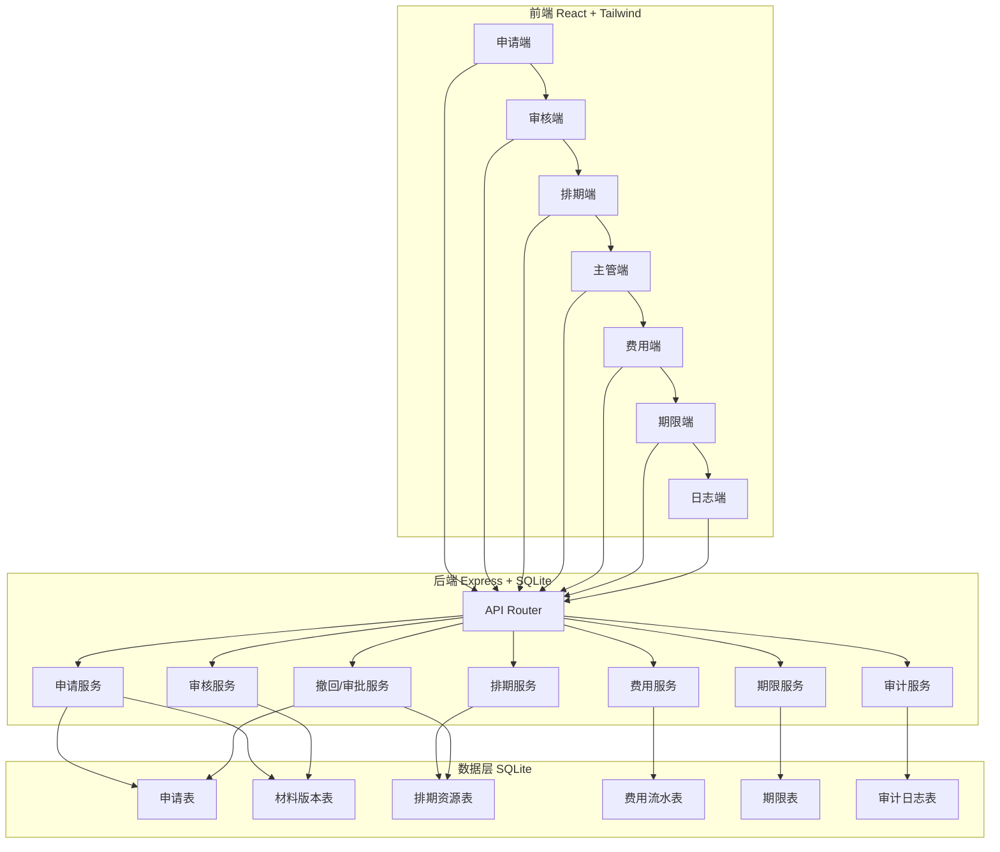
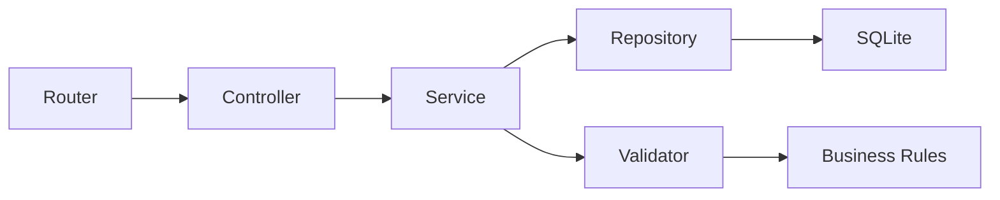
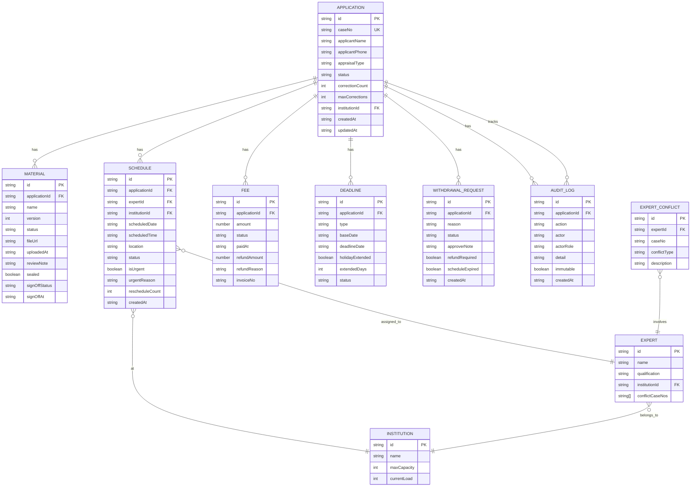

## 1. 架构设计



## 2. 技术说明

- **前端**：React@18 + TypeScript + TailwindCSS@3 + Zustand + Vite
- **后端**：Express@4 + TypeScript + better-sqlite3
- **数据库**：SQLite（嵌入式，容器零配置）
- **初始化工具**：vite-init（react-express-ts 模板）
- **UI组件**：lucide-react 图标 + 自定义组件

## 3. 路由定义

### 3.1 前端路由

| 路由 | 用途 |
|------|------|
| `/` | 首页/角色选择入口 |
| `/apply` | 申请提交页 |
| `/my-cases` | 我的申请进度页 |
| `/review` | 材料审核页 |
| `/schedule` | 排期管理页 |
| `/supervisor` | 主管审批页 |
| `/fees` | 费用管理页 |
| `/deadline` | 期限预警页 |
| `/audit-log` | 流程日志页 |

### 3.2 后端API路由

| 方法 | 路由 | 用途 |
|------|------|------|
| POST | `/api/applications` | 提交申请 |
| GET | `/api/applications` | 查询申请列表 |
| GET | `/api/applications/:id` | 查询申请详情 |
| POST | `/api/applications/:id/materials` | 上传材料/补正材料 |
| PUT | `/api/applications/:id/review` | 审核材料（通过/退回补正） |
| PUT | `/api/applications/:id/accept` | 受理案件 |
| POST | `/api/applications/:id/schedule` | 创建排期 |
| PUT | `/api/schedules/:id` | 修改排期/改期 |
| DELETE | `/api/schedules/:id` | 取消排期 |
| GET | `/api/schedules/conflicts` | 排期冲突检测 |
| POST | `/api/applications/:id/withdraw` | 申请撤回 |
| PUT | `/api/withdrawals/:id/approve` | 撤回审批 |
| POST | `/api/applications/:id/urgent` | 加急申请 |
| PUT | `/api/urgents/:id/approve` | 加急审批 |
| POST | `/api/fees/:appId/pay` | 缴费 |
| POST | `/api/fees/:appId/refund` | 退款 |
| GET | `/api/fees/:appId/invoice` | 获取发票 |
| GET | `/api/deadlines` | 期限查询 |
| GET | `/api/deadlines/warnings` | 期限预警 |
| GET | `/api/audit-logs` | 审计日志查询 |
| GET | `/api/experts/conflicts` | 专家冲突检测 |
| GET | `/api/institutions/capacity` | 机构容量查询 |

## 4. API定义

### 4.1 核心类型

```typescript
interface Application {
  id: string;
  caseNo: string;
  applicantName: string;
  applicantPhone: string;
  appraisalType: string;
  status: 'draft' | 'submitted' | 'reviewing' | 'correction_needed' | 'corrected' | 'accepted' | 'scheduled' | 'in_progress' | 'completed' | 'withdrawn' | 'terminated';
  correctionCount: number;
  maxCorrections: number;
  institutionId: string;
  createdAt: string;
  updatedAt: string;
}

interface Material {
  id: string;
  applicationId: string;
  name: string;
  version: number;
  status: 'pending' | 'approved' | 'rejected';
  fileUrl: string;
  uploadedAt: string;
  reviewNote: string;
  sealed: boolean;
  signOffStatus: 'unsigned' | 'signed';
  signOffAt: string | null;
}

interface Schedule {
  id: string;
  applicationId: string;
  expertId: string;
  institutionId: string;
  scheduledDate: string;
  scheduledTime: string;
  location: string;
  status: 'pending' | 'confirmed' | 'completed' | 'cancelled' | 'expired';
  isUrgent: boolean;
  urgentReason: string;
  rescheduleCount: number;
  createdAt: string;
}

interface Fee {
  id: string;
  applicationId: string;
  amount: number;
  status: 'unpaid' | 'paid' | 'refunded';
  paidAt: string | null;
  refundAmount: number;
  refundReason: string;
  invoiceNo: string;
}

interface Deadline {
  id: string;
  applicationId: string;
  type: 'correction' | 'review' | 'schedule' | 'appraisal' | 'completion';
  baseDate: string;
  deadlineDate: string;
  holidayExtended: boolean;
  extendedDays: number;
  status: 'active' | 'paused' | 'expired' | 'completed';
}

interface WithdrawalRequest {
  id: string;
  applicationId: string;
  reason: string;
  status: 'pending' | 'approved' | 'rejected';
  approverNote: string;
  refundRequired: boolean;
  scheduleExpired: boolean;
  createdAt: string;
}

interface AuditLog {
  id: string;
  applicationId: string;
  action: string;
  actor: string;
  actorRole: string;
  detail: string;
  immutable: true;
  createdAt: string;
}
```

### 4.2 请求/响应模式

```typescript
interface ApiResponse<T> {
  success: boolean;
  data?: T;
  error?: string;
  code?: string;
}

interface ConflictResult {
  hasConflict: boolean;
  conflicts: Array<{
    type: 'time' | 'expert' | 'location' | 'capacity';
    message: string;
    conflictingScheduleId: string;
  }>;
}
```

## 5. 服务端架构图



## 6. 数据模型

### 6.1 数据模型图



### 6.2 数据定义语言（DDL）

```sql
CREATE TABLE institution (
  id TEXT PRIMARY KEY,
  name TEXT NOT NULL,
  max_capacity INTEGER NOT NULL DEFAULT 10,
  current_load INTEGER NOT NULL DEFAULT 0,
  created_at TEXT NOT NULL DEFAULT (datetime('now'))
);

CREATE TABLE expert (
  id TEXT PRIMARY KEY,
  name TEXT NOT NULL,
  qualification TEXT NOT NULL,
  institution_id TEXT NOT NULL REFERENCES institution(id),
  conflict_case_nos TEXT DEFAULT '[]',
  created_at TEXT NOT NULL DEFAULT (datetime('now'))
);

CREATE TABLE application (
  id TEXT PRIMARY KEY,
  case_no TEXT NOT NULL UNIQUE,
  applicant_name TEXT NOT NULL,
  applicant_phone TEXT NOT NULL,
  appraisal_type TEXT NOT NULL,
  status TEXT NOT NULL DEFAULT 'draft',
  correction_count INTEGER NOT NULL DEFAULT 0,
  max_corrections INTEGER NOT NULL DEFAULT 3,
  institution_id TEXT REFERENCES institution(id),
  created_at TEXT NOT NULL DEFAULT (datetime('now')),
  updated_at TEXT NOT NULL DEFAULT (datetime('now'))
);

CREATE TABLE material (
  id TEXT PRIMARY KEY,
  application_id TEXT NOT NULL REFERENCES application(id),
  name TEXT NOT NULL,
  version INTEGER NOT NULL DEFAULT 1,
  status TEXT NOT NULL DEFAULT 'pending',
  file_url TEXT,
  uploaded_at TEXT NOT NULL DEFAULT (datetime('now')),
  review_note TEXT,
  sealed INTEGER NOT NULL DEFAULT 0,
  sign_off_status TEXT NOT NULL DEFAULT 'unsigned',
  sign_off_at TEXT
);

CREATE TABLE schedule (
  id TEXT PRIMARY KEY,
  application_id TEXT NOT NULL REFERENCES application(id),
  expert_id TEXT NOT NULL REFERENCES expert(id),
  institution_id TEXT NOT NULL REFERENCES institution(id),
  scheduled_date TEXT NOT NULL,
  scheduled_time TEXT NOT NULL,
  location TEXT NOT NULL,
  status TEXT NOT NULL DEFAULT 'pending',
  is_urgent INTEGER NOT NULL DEFAULT 0,
  urgent_reason TEXT,
  reschedule_count INTEGER NOT NULL DEFAULT 0,
  created_at TEXT NOT NULL DEFAULT (datetime('now'))
);

CREATE TABLE fee (
  id TEXT PRIMARY KEY,
  application_id TEXT NOT NULL REFERENCES application(id),
  amount REAL NOT NULL,
  status TEXT NOT NULL DEFAULT 'unpaid',
  paid_at TEXT,
  refund_amount REAL DEFAULT 0,
  refund_reason TEXT,
  invoice_no TEXT
);

CREATE TABLE deadline (
  id TEXT PRIMARY KEY,
  application_id TEXT NOT NULL REFERENCES application(id),
  type TEXT NOT NULL,
  base_date TEXT NOT NULL,
  deadline_date TEXT NOT NULL,
  holiday_extended INTEGER NOT NULL DEFAULT 0,
  extended_days INTEGER NOT NULL DEFAULT 0,
  status TEXT NOT NULL DEFAULT 'active'
);

CREATE TABLE withdrawal_request (
  id TEXT PRIMARY KEY,
  application_id TEXT NOT NULL REFERENCES application(id),
  reason TEXT NOT NULL,
  status TEXT NOT NULL DEFAULT 'pending',
  approver_note TEXT,
  refund_required INTEGER NOT NULL DEFAULT 0,
  schedule_expired INTEGER NOT NULL DEFAULT 0,
  created_at TEXT NOT NULL DEFAULT (datetime('now'))
);

CREATE TABLE audit_log (
  id TEXT PRIMARY KEY,
  application_id TEXT NOT NULL REFERENCES application(id),
  action TEXT NOT NULL,
  actor TEXT NOT NULL,
  actor_role TEXT NOT NULL,
  detail TEXT NOT NULL,
  immutable INTEGER NOT NULL DEFAULT 1,
  created_at TEXT NOT NULL DEFAULT (datetime('now'))
);

CREATE TABLE expert_conflict (
  id TEXT PRIMARY KEY,
  expert_id TEXT NOT NULL REFERENCES expert(id),
  case_no TEXT NOT NULL,
  conflict_type TEXT NOT NULL,
  description TEXT
);

CREATE TABLE holiday (
  id TEXT PRIMARY KEY,
  date TEXT NOT NULL UNIQUE,
  name TEXT NOT NULL
);

CREATE INDEX idx_application_case_no ON application(case_no);
CREATE INDEX idx_application_status ON application(status);
CREATE INDEX idx_material_application_id ON material(application_id);
CREATE INDEX idx_schedule_application_id ON schedule(application_id);
CREATE INDEX idx_schedule_expert_date ON schedule(expert_id, scheduled_date);
CREATE INDEX idx_schedule_institution_date ON schedule(institution_id, scheduled_date);
CREATE INDEX idx_fee_application_id ON fee(application_id);
CREATE INDEX idx_deadline_application_id ON deadline(application_id);
CREATE INDEX idx_audit_log_application_id ON audit_log(application_id);
CREATE INDEX idx_withdrawal_application_id ON withdrawal_request(application_id);
CREATE UNIQUE INDEX idx_schedule_conflict ON schedule(expert_id, scheduled_date, scheduled_time, status);
```
